<div align="center">
  
</div>

<br>

<div align="center">

# Artemisia Weyl

**Data & AI Architect · Data Engineer · Programming Professor · Physicist at heart**

`data platforms` · `AI architecture` · `MLOps` · `data reliability` · `cloud` · `scientific thinking`

🌌 Transformando dados brutos em sistemas confiáveis, modelos úteis e conhecimento compartilhado.

🔭 Turning raw data into reliable systems, useful models, and knowledge worth sharing.

<a href="mailto:arteweyl@gmail.com">
  
</a>
<a href="https://www.linkedin.com/in/arteweyl/">
  
</a>
<a href="https://artemisia-weyl.netlify.app/">
  
</a>

</div>

---

<div align="center">
  <a href="#-diário-de-bordo--português">Português</a> · <a href="#-mission-log--english">English</a> · <a href="#-constelação-tecnológica--tech-constellation">Tech constellation</a>
</div>

---

```text
                 ✦                 .
       research  ──────►  engineering  ──────►  impact
           .              ▲    │                    ✧
                          │    ▼
                     teaching + AI
```

## 🛰️ Diário de bordo · Português

Sou **Arquiteta de IA e Dados e Engenheira de Dados**, com **17 anos de trajetória em STEM e 9 anos dedicados a dados**. Minha experiência cruza pesquisa científica, engenharia de software, plataformas multi-cloud, machine learning, governança e educação. Gosto de trabalhar onde problemas complexos precisam ganhar estrutura: pipelines observáveis, arquiteturas confiáveis, modelos que chegam à produção e decisões técnicas que continuam fazendo sentido depois do deploy.

Minha jornada começou na pesquisa em ciência dos materiais, investigando temas ligados a materiais para computação quântica. A Física me ensinou a formular boas perguntas, testar hipóteses e respeitar evidências; hoje, levo esse mesmo método para ecossistemas de dados, cloud, DataOps e MLOps.

Também sou professora de programação e dados. Lecionei na **Byju's Future School**, participei da criação de conteúdo de **Python, SQL e Machine Learning na Coderhouse Brasil** e atuo na **PUCRS** em disciplinas práticas de programação e People Analytics. Ensinar é parte central da minha engenharia: conhecimento só completa sua órbita quando pode ser compreendido, usado e multiplicado.

Já atuei em contextos financeiros críticos, educação pública, operações humanitárias, consultoria e produtos digitais. No momento, minha bússola aponta para arquiteturas de IA responsáveis, plataformas de dados resilientes, observabilidade, governança e experiências que aproximam ciência, tecnologia e pessoas.

## 🚀 Mission log · English

I am a **Data & AI Architect and Data Engineer** with **17 years across STEM and 9 years focused on data**. My experience spans scientific research, software engineering, multi-cloud platforms, machine learning, governance, and technology education. I am drawn to the point where complex problems need structure: observable pipelines, dependable architectures, production-ready models, and technical decisions that remain sound long after deployment.

My journey began in materials science research, with a particular interest in materials for quantum computing. Physics taught me how to frame useful questions, test hypotheses, and follow evidence; I now bring that same discipline to cloud ecosystems, DataOps, MLOps, and large-scale data engineering.

I am also a programming and data professor. I taught at **Byju's Future School**, helped create **Python, SQL, and Machine Learning content for Coderhouse Brazil**, and teach hands-on programming labs and People Analytics at **PUCRS**. Teaching is part of how I engineer: knowledge reaches its full orbit only when others can understand it, use it, and build upon it.

I have worked across critical financial environments, public education, humanitarian operations, consulting, and digital products. My current trajectory is centered on responsible AI architectures, resilient data platforms, observability, governance, and experiences that connect science, technology, and people.

## 🪐 Current orbit · Órbita atual

| Orbit | What happens there |
| :--- | :--- |
| 🛰️ Data & AI Architecture | Design platforms, integration patterns, governance boundaries, and paths from experimentation to production. |
| 🌐 Data Engineering | Build and maintain pipelines, distributed workflows, and reliable data products across cloud environments. |
| 🤖 MLOps & Applied AI | Connect trustworthy data foundations to experimentation, deployment, monitoring, and responsible AI delivery. |
| 🔭 Scientific Computing | Bring physics, numerical reasoning, reproducibility, and research discipline into software and data work. |
| ✨ Teaching | Teach programming, data practices, and analytical thinking while turning difficult concepts into practical learning. |

## 🌍 Career orbit · Órbita profissional

| Mission | Role and impact |
| :--- | :--- |
| **Base dos Dados** | Data Project Manager coordinating a public education data ecosystem with GCP, BigQuery, Medallion Architecture, governance, and Generative AI. |
| **Santander Corretora / Toro** | Senior Data Engineer working with investment data architecture, regulatory compliance, LGPD, and Zero Trust security. |
| **Cruz Vermelha Brasileira** | Data and Technical Governance Specialist modernizing humanitarian reporting and applying COBIT, DAMA-DMBOK, and LGPD practices. |
| **IBM** | Senior Data Platform Engineer delivering Databricks, Azure, AWS Athena, Airflow, and Kubernetes solutions for critical financial environments. |
| **Coderhouse** | Technical Specialist and Data Instructor leading curricula and teams across Python, SQL, and Data Analytics. |
| **TEIA** | Senior Data Engineer and Tech Lead building a scalable GCP data platform and ETL pipelines for 14 clients. |

## 🔬 Launch sequence · Formação

```text
Electronics Technician
        ↓
Physics: bachelor's + teaching degree
        ↓
Applied Quantum Theory & Computational Modeling: master's degree
        ↓
Computer Engineering + CS50
        ↓
Data platforms, governance, cloud, MLOps, and AI architecture
```

- **MSc in Physics** · Applied Quantum Theory for Materials and Computational Modeling · UFPA
- **Computer Engineering** · UFPA
- **BSc and Teaching Degree in Physics** · UFPA
- **CS50: Computer Science** · Harvard University
- **Electronics Technician** · Instituto Federal do Pará

## 🧭 Governance radar

`LGPD` · `Zero Trust` · `DAMA-DMBOK` · `COBIT` · `data quality` · `lineage` · `observability` · `regulatory compliance` · `technical mentorship`

## 🌠 Constelação tecnológica · Tech constellation

### Languages

<p>
  
  
  
  
  
</p>

### Data Engineering Platform

<p>
  
  
  
  
  
  
  
  
</p>

### DataOps and Reliability

<p>
  
  
  
  
  
  
  
  
</p>

### Databases

<p>
  
  
  
  
  
</p>

### MLOps and Applied ML

<p>
  
  
  
  
  
  
  
  
  
</p>

### Back-End and APIs

<p>
  
  
  
  
</p>

### Cloud, DevOps and Tools

<p>
  
  
  
  
  
  
  
  
  
  
  
  
</p>

## 🌌 Mission portals · Projetos em órbita

| Portal | Signal |
| :--- | :--- |
| [Eletropostos Brasil](https://arteweyl.github.io/eletropostosbrasil/) | Public data and visualization for electric mobility infrastructure in Brazil. |
| [EHT MLOps Pipeline](https://arteweyl.github.io/EHT-MLOps-Pipeline/) | Reproducible MLOps inspired by Event Horizon Telescope observations. |
| [EHT MLOps Chatbot RAG](https://arteweyl.github.io/EHT-MLOps-Chatbot-RAG-pipeline/) | Airflow, model monitoring, registry, and RAG applied to scientific results. |
| [GameCerto](https://arteweyl.github.io/projeto-gameCerto/) | Hybrid lexical and semantic game recommendation running in the browser. |
| [GameCerto AI](https://arteweyl.github.io/game-certo-ai-version/) | Experimental AI reranking with local and generative models. |
| [Lero-Lero de Valfenda](https://arteweyl.github.io/lerolero_valfenda/) | A playful web experiment connecting language, humor, and product design. |

## 📡 Navigation signals · Sinais de navegação

```text
research roots       -> physics, materials science, quantum computing materials
architecture focus   -> scalable data platforms, governance, cloud, responsible AI
dataops mindset      -> quality, lineage, CI/CD, observability, reproducibility
mlops practice       -> experiment tracking, model versioning, serving, drift monitoring
leadership orbit     -> strategy, mentorship, multidisciplinary teams, data culture
teaching practice    -> programming, Python, SQL, ML, People Analytics
languages spoken     -> Portuguese, English, Spanish, Japanese
favorite problems    -> trustworthy data, useful AI, robust workflows
```

---

<div align="center">

✦ **Building data systems with scientific curiosity and production discipline.** ✦

**Construindo sistemas de dados com curiosidade científica, governança e disciplina de produção.**

</div>
