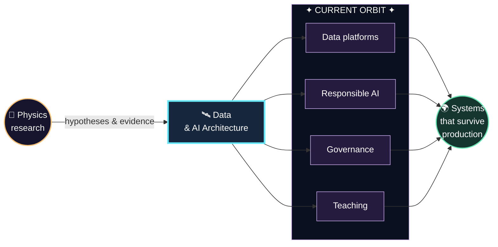
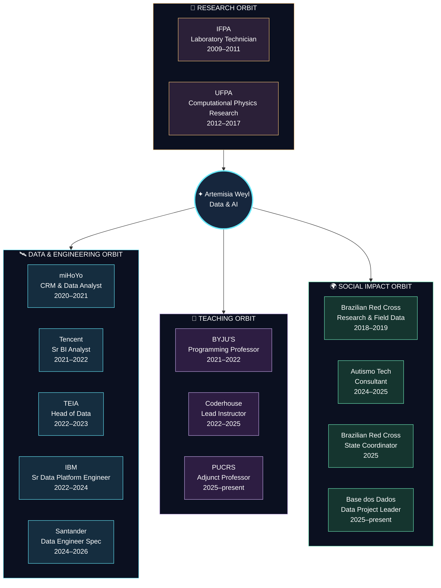

<div align="center">
  
</div>

<br>

<div align="center">

# Artemisia Weyl

**Data & AI Architect · Data Engineer · Programming Professor · Physicist at heart**

`data platforms` · `AI architecture` · `MLOps` · `data reliability` · `cloud` · `scientific thinking`

🌌 Transformando dados brutos em sistemas confiáveis, modelos úteis e conhecimento compartilhado.

🔭 Turning raw data into reliable systems, useful models, and knowledge worth sharing.

<a href="mailto:arteweyl@gmail.com">
  
</a>
<a href="https://www.linkedin.com/in/arteweyl/">
  
</a>
<a href="https://artemisia-weyl.netlify.app/">
  
</a>

</div>

---

<div align="center">
  <a href="#-diário-de-bordo--português">Português</a> · <a href="#-mission-log--english">English</a> · <a href="#-constelação-tecnológica--tech-constellation">Tech constellation</a>
</div>

---



## 🛰️ Diário de bordo · Português

Sou Arquiteta de IA e Dados e Engenheira de Dados, com 17 anos de trajetória em STEM e 9 anos trabalhando diretamente com dados.

Comecei na Física, pesquisando ciência dos materiais e temas ligados à computação quântica. Foi ali que aprendi a formular hipóteses, testar limites e desconfiar de qualquer explicação que dependa de magia, mesmo quando ela vem acompanhada de um diagrama bonito.

Hoje trabalho com arquitetura de dados e IA, plataformas multi-cloud, machine learning, governança, DataOps e MLOps.

Gosto de problemas grandes, bagunçados e cheios de dependências escondidas. Meu trabalho costuma ser descobrir onde está o gargalo, separar complexidade real de filler e transformar isso em uma arquitetura que alguém consiga operar depois.

Para mim, arquitetura boa é a que continua fazendo sentido quando o slide acaba, o dado chega atrasado, uma API cai e alguém precisa entender o que aconteceu às três da manhã.

Também sou professora de programação e dados. Lecionei na Byju's Future School, produzi conteúdos de Python, SQL e Machine Learning na Coderhouse Brasil e atuo na PUCRS com programação e People Analytics.

Ensinar faz parte da engenharia. Se apenas uma pessoa entende o sistema, temos um jutsu secreto de clã e um ponto único de falha.

Já trabalhei com mercado financeiro, educação pública, operações humanitárias, consultoria e produtos digitais. Atualmente, concentro meu trabalho em arquiteturas responsáveis de IA, plataformas resilientes, observabilidade e governança.

Gosto de construir coisas que funcionem em produção, explicar assuntos difíceis sem ritual de invocação e evitar que uma solução simples vire um arco de 200 episódios.

## 🚀 Mission log · English

I am a Data & AI Architect and Data Engineer with 17 years across STEM and 9 years working directly with data.

I started in Physics, researching materials science and topics related to quantum computing. That is where I learned to frame hypotheses, test limits, and question any explanation that depends on magic, even when it comes with a polished architecture diagram.

Today, I work with Data and AI architecture, multi-cloud platforms, machine learning, governance, DataOps, and MLOps.

I enjoy large, messy problems with hidden dependencies. My job is usually to find the real bottleneck, separate actual complexity from filler, and turn the result into an architecture that people can operate after deployment.

A good architecture should still make sense when the slides are gone, data arrives late, an API fails, and someone needs to understand what happened at 3 a.m.

I am also a programming and data professor. I taught at Byju's Future School, created Python, SQL, and Machine Learning content for Coderhouse Brazil, and teach programming and People Analytics at PUCRS.

Teaching is part of engineering. When only one person understands a system, you have a forbidden clan technique and a single point of failure.

I have worked across financial systems, public education, humanitarian operations, consulting, and digital products. My current work focuses on responsible AI architectures, resilient data platforms, observability, and governance.

I like building systems that survive production, explaining difficult topics without a summoning ritual, and preventing simple solutions from becoming 200-episode story arcs.

## 🪐 Current orbit · Órbita atual

| Orbit | What happens there |
| :--- | :--- |
| 🛰️ Data & AI Architecture | Design platforms, integration patterns, governance boundaries, and paths from experimentation to production. |
| 🌐 Data Engineering | Build and maintain pipelines, distributed workflows, and reliable data products across cloud environments. |
| 🤖 MLOps & Applied AI | Connect trustworthy data foundations to experimentation, deployment, monitoring, and responsible AI delivery. |
| 🔭 Scientific Computing | Bring physics, numerical reasoning, reproducibility, and research discipline into software and data work. |
| ✨ Teaching | Teach programming, data practices, and analytical thinking while turning difficult concepts into practical learning. |

## 🌍 Career orbit · Órbita profissional

| Mission | Role and impact |
| :--- | :--- |
| **Base dos Dados** | Data Project Manager coordinating a public education data ecosystem with GCP, BigQuery, Medallion Architecture, governance, and Generative AI. |
| **Santander Corretora / Toro** | Senior Data Engineer working with investment data architecture, regulatory compliance, LGPD, and Zero Trust security. |
| **Cruz Vermelha Brasileira** | Data and Technical Governance Specialist modernizing humanitarian reporting and applying COBIT, DAMA-DMBOK, and LGPD practices. |
| **IBM** | Senior Data Platform Engineer delivering Databricks, Azure, AWS Athena, Airflow, and Kubernetes solutions for critical financial environments. |
| **Coderhouse** | Technical Specialist and Data Instructor leading curricula and teams across Python, SQL, and Data Analytics. |
| **TEIA** | Senior Data Engineer and Tech Lead building a scalable GCP data platform and ETL pipelines for 14 clients. |

### ✦ Experience constellation · Constelação de experiências



## 🔬 Launch sequence · Formação

```text
Electronics Technician
        ↓
Physics: bachelor's + teaching degree
        ↓
Applied Quantum Theory & Computational Modeling: master's degree
        ↓
Complex Systems: doctorate
        ↓
Computer Engineering + CS50
        ↓
Data platforms, governance, cloud, MLOps, and AI architecture
```

- **Doctorate in Complex Systems** · USP
- **MSc in Physics** · Applied Quantum Theory for Materials and Computational Modeling · UFPA
- **Computer Engineering** · UFPA
- **BSc and Teaching Degree in Physics** · UFPA
- **CS50: Computer Science** · Harvard University
- **Electronics Technician** · Instituto Federal do Pará

## 🧭 Governance radar

`LGPD` · `Zero Trust` · `DAMA-DMBOK` · `COBIT` · `data quality` · `lineage` · `observability` · `regulatory compliance` · `technical mentorship`

## 🌠 Constelação tecnológica · Tech constellation

### Languages

<p>
  
  
  
  
  
</p>

### Data Engineering Platform

<p>
  
  
  
  
  
  
  
  
</p>

### DataOps and Reliability

<p>
  
  
  
  
  
  
  
  
</p>

### Databases

<p>
  
  
  
  
  
</p>

### MLOps and Applied ML

<p>
  
  
  
  
  
  
  
  
  
</p>

### Back-End and APIs

<p>
  
  
  
  
</p>

### Cloud, DevOps and Tools

<p>
  
  
  
  
  
  
  
  
  
  
  
  
</p>

## 🌌 Mission portals · Projetos em órbita

| Portal | Signal |
| :--- | :--- |
| [State of Data Brasil](https://state-of-data.artemisiaweyl.com.br/) | Public-data product that turns five years of the Brazilian data-profession survey into reproducible analysis. |
| [Eletropostos Brasil](https://arteweyl.github.io/eletropostosbrasil/) | Data pipeline and visualization for Brazil's electric-mobility infrastructure. |
| [EHT MLOps Chatbot RAG](https://arteweyl.github.io/EHT-MLOps-Chatbot-RAG-pipeline/) | Airflow, drift monitoring, registry, and RAG applied to auditable scientific results. |
| [GameCerto](https://arteweyl.github.io/projeto-gameCerto/) | Hybrid lexical and semantic game recommendation running in the browser. |
| [Lero-Lero de Valfenda](https://arteweyl.github.io/lerolero_valfenda/) | A playful, local-first language experiment connecting humor, AI, and product design. |
| [Missão Barcarena](https://github.com/arteweyl/missao_barcarena) | A reproducible public archive that turns documentary fragments into a navigable data narrative. |

## 📡 Navigation signals · Sinais de navegação

```text
research roots       -> physics, materials science, quantum computing materials
architecture focus   -> scalable data platforms, governance, cloud, responsible AI
dataops mindset      -> quality, lineage, CI/CD, observability, reproducibility
mlops practice       -> experiment tracking, model versioning, serving, drift monitoring
leadership orbit     -> strategy, mentorship, multidisciplinary teams, data culture
teaching practice    -> programming, Python, SQL, ML, People Analytics
languages spoken     -> Portuguese, English, Spanish, Japanese
favorite problems    -> trustworthy data, useful AI, robust workflows
```

---

<div align="center">

✦ **Building data systems with scientific curiosity and production discipline.** ✦

**Construindo sistemas de dados com curiosidade científica, governança e disciplina de produção.**

</div>
